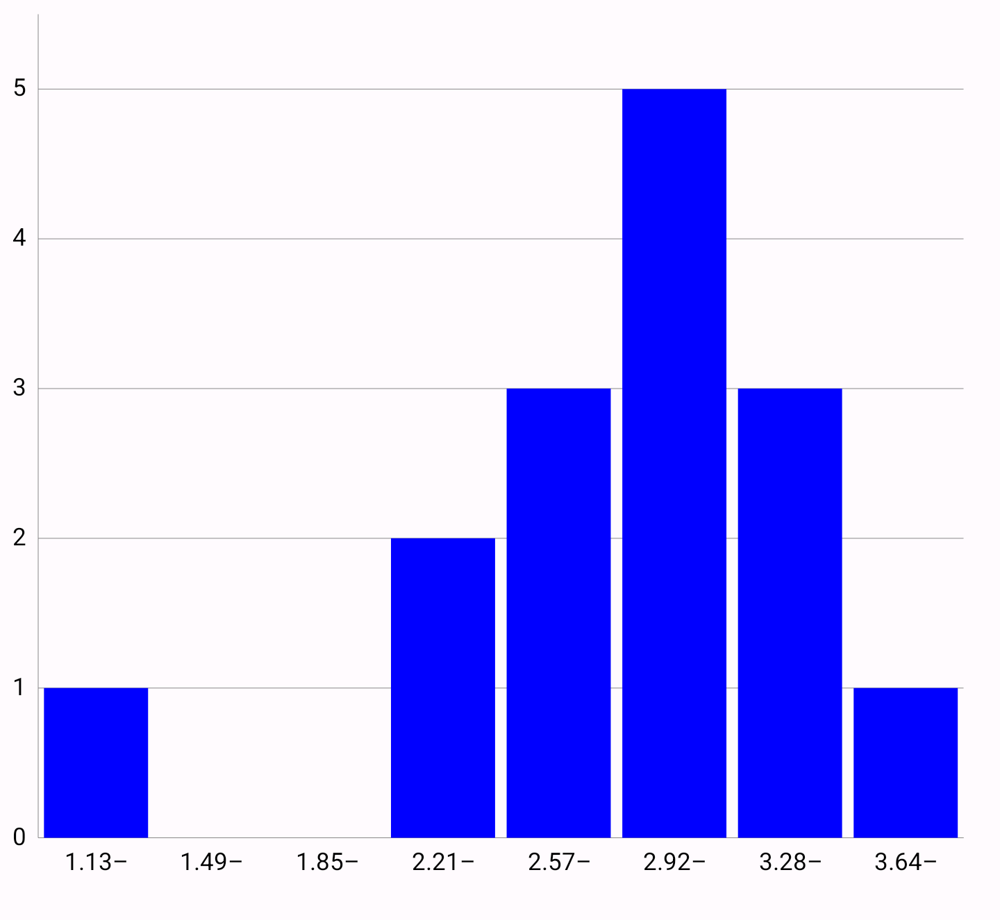
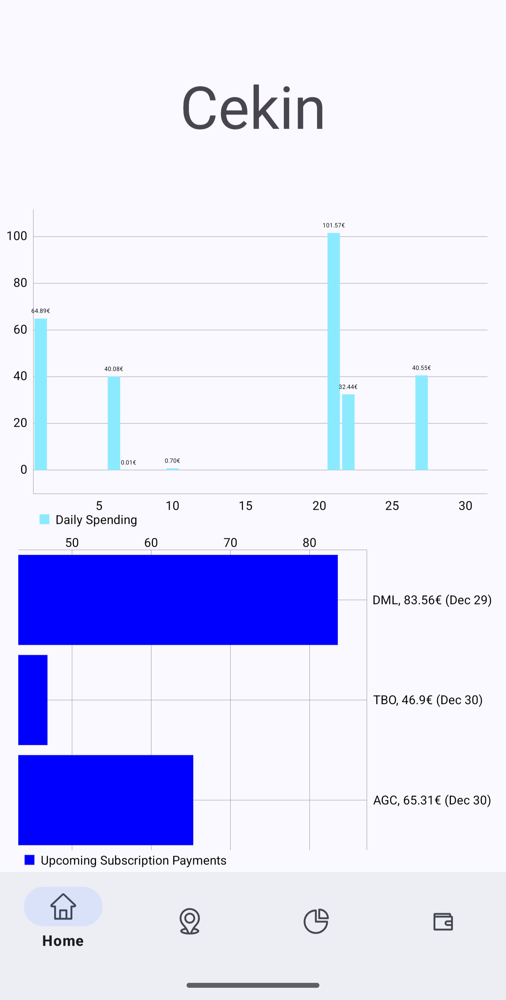

# MPAndroidChart Demo
- Knjižnica za risanje grafov na Androidu

## Priprava

### V `settings.gradle.kts` dodamo
```groovy
repositories {
        maven {
            url = uri("https://jitpack.io")
        }
    }
```
*(Jitpack je podpora za objavljanje Java ali Android knjižnic)*

### V `build.gradle.kts` (Module :app)
```groovy
dependencies {
    implementation('com.github.PhilJay:MPAndroidChart:v3.1.0')
}
```

## Primer



```xml
<com.github.mikephil.charting.charts.BarChart
        android:id="@+id/barChart"
        android:layout_width="match_parent"
        android:layout_height="0dp"
        android:layout_marginTop="32dp"
        app:layout_constraintBottom_toTopOf="@id/guideline"
        app:layout_constraintEnd_toEndOf="parent"
        app:layout_constraintStart_toStartOf="parent"
        app:layout_constraintTop_toTopOf="parent" />
```

```kotlin
val barChart = binding.barChart

val data = listOf(1.13f, 2.4f, 2.56f, 2.69f, 2.76f, 2.9f, 2.956f, 3.0f,
    3.0f, 3.007f, 3.1f, 3.3f, 3.4f, 3.419f, 4.0f)

// Data prep
val binCount = 8
val min = data.minOrNull() ?: 0f
val max = data.maxOrNull() ?: 0f
val binSize = (max - min) / binCount

val dataSet = createHistogramDataSet(binCount, data, min, binSize)
dataSet.color = Color.BLUE
dataSet.setDrawValues(false)

val barData = BarData(dataSet)
barData.barWidth = 0.9f

barChart.data = barData

//Graph settings
barChart.apply {
    description.isEnabled = false
    axisRight.isEnabled = false
    legend.isEnabled = false
    isDoubleTapToZoomEnabled = false
}

setValueFormatter(barChart, binCount, min, binSize)

barChart.xAxis.apply {
    position = XAxis.XAxisPosition.BOTTOM
    granularity = 1f
    setDrawGridLines(false)
    setDrawAxisLine(true)
}

barChart.axisLeft.apply {
    granularity = 1f
    axisMinimum = 0f
}

barChart.invalidate() //redraw chart
```

## Ostali Grafi
[**MPAndroidChart More Examples**](https://github.com/PhilJay/MPAndroidChart/tree/master?tab=readme-ov-file#more-examples-1)

## Utemeljitev izbire, uporaba v lastnem projektu
+ Grafe sem hotel dodati 2. aplikaciji pri vajah PORA, da bi bolje prikazal podatke.

+ Namen aplikacije je sledenje stroškov uporabnika, njegovih računov in naročnin.



## Prednosti
+ Podpira veliko vrst grafov.
+ Ima ogromno nastavitev za prilagajanje.
+ Vgrajena podpora za delo na dotik (približevanje, označevanje ...)

## Slabosti
+ Dokumentacija ni najboljša
+ Zelo osnovni grafi še vseeno potrebujejo precej kode
+ Možni performančni problemi pri velikih količinah podatkov

## Ostali osnovni podatki
### Licenca
Copyright: ©Philipp Jahoda

Pod licenco [**Apache License, Version 2.0**](https://www.apache.org/licenses/LICENSE-2.0)


### Št. uporabnikov
Glede na 38.000 zvezdic na GitHubu je sam projekt precej popularen in bi ga lahko uporabljalo 
nekje pol milijona razvijalcev/projektov.

Drugi podatki pravtako kažejo uporabo v več kot 10.000 Android aplikacijah s skupno miljardami
prenosov.

### Časovna zahtevnost
Delo z grafom z `n` točkami ima zahtevnost `O(n)` pri:
 - izrisovanju
 - skaliranju
 - formatiranju podatkov
 - posodobitvi točk

### Prostorska zahtevnost
Podobno kot pri času, `O(n)` glede na število točk, ki jih graf uporablja.

### Vzdrževanje
Zadnji commit pred pol leta. K projektu prispevalo 68 ljudi.